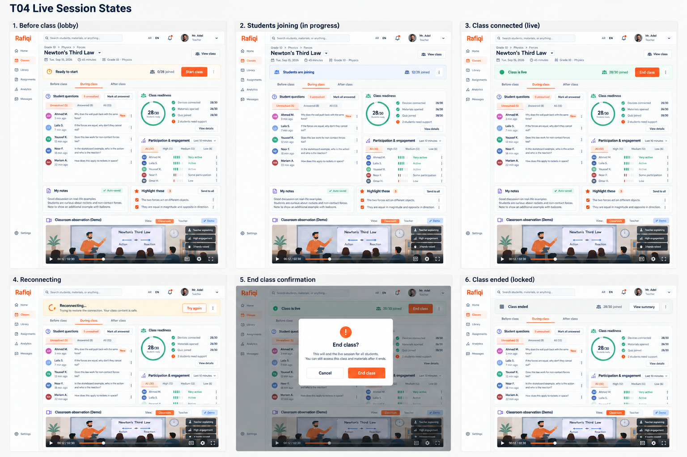

# Board 19 - T04 live-session states

## Purpose

Historical desktop teacher reference for **C1 Start/join session** and **C2 Live connection**, both deferred to MVP v2. It must not drive MVP v1 implementation or realtime infrastructure. Every panel is the existing **T04 · Teacher · Prepare and teach (During class)** screen with a session-state layer; it is not a new dashboard or meeting shell.

## States shown

1. **Lobby:** existing T04 content plus a slim ready-to-start strip, 0/28 joined, and Start class.
2. **Students joining:** the same T04 content plus join progress.
3. **Connected:** the same T04 content plus a green live strip, participant count, and End class.
4. **Reconnecting:** a narrow recoverable banner; questions, readiness, engagement, notes, highlights, and observation stay usable/visible.
5. **End confirmation:** an explicit modal over the real T04 page.
6. **Locked:** an ended-session summary strip while the existing class information remains readable.

## Implementation rules

- Preserve T04's sidebar, top bar, phase tabs, Student questions, Class readiness, Participation & engagement, My notes, Highlight these, and Classroom observation.
- Add session status only as a slim layer above the existing content; do not replace T04's card hierarchy or create a generic video-call layout.
- Include ready, joining, connected, reconnecting, failure/retry, confirmation, and locked states.
- This board defines UI only. Real joining, participant counts, reconnection, and session locks need later backend/realtime work.

## Revision

The previous generic lifecycle composition is **deprecated** as of 2026-09-13. This replacement is the approved direction because it visibly retains the established T04 page throughout every state.
