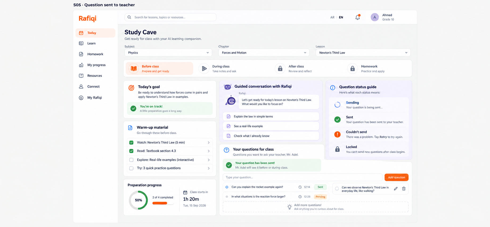

# Board 27 - S05 question sent to teacher

## Purpose

Standalone desktop reference for **B7 Ask the teacher ahead of time** within S05 Study Cave Before class.

## Approval

**Approved for the B7 frontend-only slice (2026-09-13).** Together with [Board 28](28-s04-s05-mobile-arabic-states.md), this is the UI-state specification for local/demo composing, sending, sent, pending, failed/retry, empty, local-draft edit/delete, and class-start locked states. It extends S05; it does not replace the existing Study Cave structure.

## Required UI

- Preserve S05 goal, materials, guided Rafiqi conversation, progress, selectors, and phase tabs.
- Show compose, sending, sent, pending, failure/retry, empty, and locked direction inside the existing questions-for-class card.
- Allow edit/delete only while an item remains a local unsent draft.

## Boundary

This is UI direction only. Delivery, teacher inbox visibility, and question lifecycle persistence require later services.
