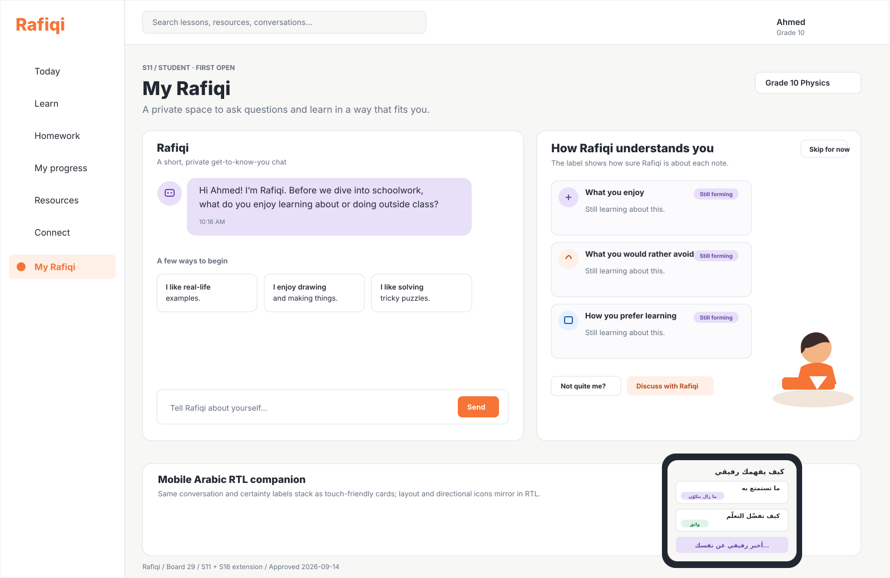

# Board 29 - S11 first-open profile onboarding

## Purpose

Canonical state extension for the first time a student opens **My Rafiqi**. It lets Rafiqi learn about the student through a short, voluntary conversation instead of a profile form, then visibly builds the learner model alongside the chat.

## Approval

**Approved for the A2/A3/A5/A6 frontend slice (2026-09-14).** This board extends **S11 Rafiqi’s Cave** and **S16 Edit how Rafiqi understands you**. It does not create a separate onboarding route or replace the existing companion workspace.

The pre-filled S11 example remains the returning-student reference. It is **deprecated only as the first-open default**; a student with no learner-model conversation begins with this Board 29 state instead.

## First-open conversation

1. Rafiqi welcomes the student and asks what they enjoy learning about or doing.
2. Rafiqi asks what types of explanations, activities, or schoolwork they would rather avoid.
3. Rafiqi asks **How you prefer learning** — for example, an example first, talking it through, or trying it independently.
4. Each answer updates the adjacent profile immediately. The student may skip without filling anything in.
5. After the third answer, Rafiqi confirms that this is a first version and continues as the normal My Rafiqi conversation.

## Learner-model states

- Start with three empty cards: **What you enjoy**, **What you would rather avoid**, and **How you prefer learning**.
- Every card shows either **Still forming** (lavender) or **Confident** (sage) beside the item title; color is never the only indicator.
- Direct, specific self-reported preferences may be marked **Confident**. A single partial or context-dependent signal remains **Still forming** until more conversation supports it.
- Keep **Not quite me?**, **Discuss with Rafiqi**, and inline Edit / Save / Cancel controls available after onboarding. The student can correct a statement at any time.
- Keep the existing learner illustration on wide layouts and hide it before it crowds content.

## Responsive and Arabic RTL direction

- Desktop retains the existing two-column S11 workspace: chat on the left, learner model on the right.
- Mobile stacks chat, learner model, then goals. Profile cards use full-width touch targets and never rely on hover.
- Arabic uses the existing RTL shell, logical spacing, mirrored send direction, and reviewed Arabic labels. The inset in the board demonstrates the correct card order and badge placement.

## Required visible states

- Loading profile state before browser-only demo state is read.
- Empty / first-open state, in-progress answers, completed first profile, skipped state, editable state, saved success, cancelled edit, and unavailable browser-storage notice.
- The goal card remains explicitly **Still forming** until the student discusses a goal; no goal is invented for a new student.

## Boundary

This board authorizes the client-side demonstration of A2/A3/A5/A6 only. The current implementation keeps the minimum profile state in a versioned, browser-session store for the active visit. It does **not** add A1 persistence, account-level identity, cross-device history, automated production inference, teacher/guardian access, or any data sharing. A1 and A8 (the data privacy review) remain prerequisites for production profile storage and inference.
