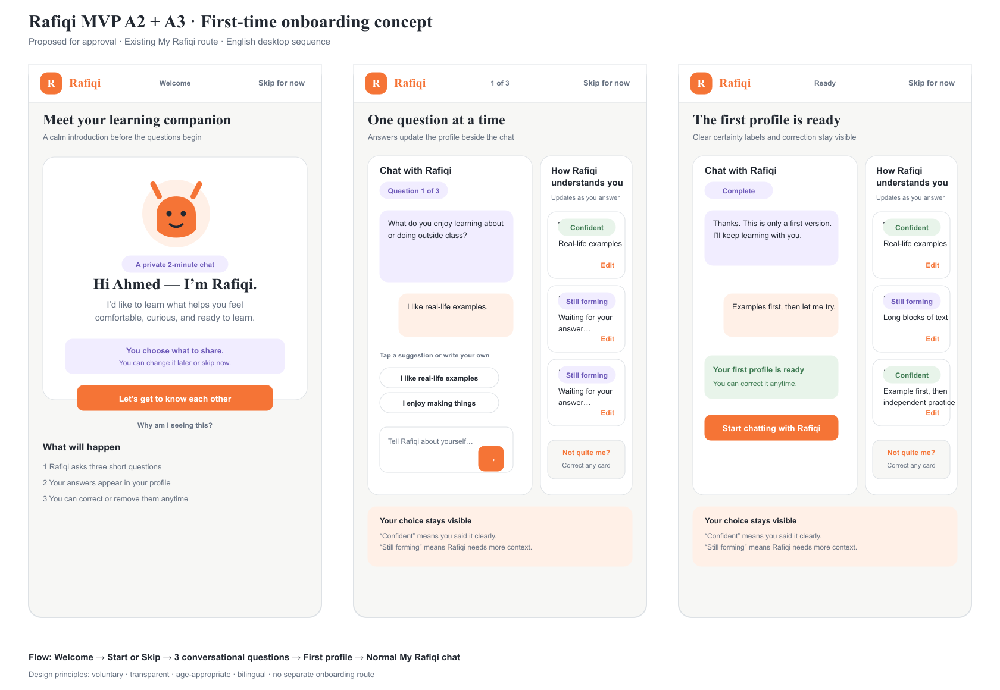

# Board 30 — S11 first-time onboarding welcome concept

[Open editable SVG](30-s11-onboarding-welcome-concept.svg)

## Superseded proposal

**Superseded on 2026-09-14 by [Board 32 — First-login student onboarding](32-first-login-onboarding.md).** The revised requirement places onboarding immediately after first login, before the student workspace.

## Status

**Proposed for design approval. Do not implement yet.** This concept is a candidate revision to [Board 29](29-s11-first-open-profile.md). Board 29 and the current frontend remain the approved, implemented reference until this board is accepted.

## Product fit

- **A2 — Cave chat:** Rafiqi learns about the student through a short conversation inside the existing **My Rafiqi** workspace.
- **A3 — Profile updates from chat:** each answer updates a visible learner-profile card and shows whether the understanding is **Confident** or **Still forming**.

The flow preserves the correction affordance required by A5/A6 because transparency and student control are part of a credible A3 experience.

## Design idea

The first opening begins with a dedicated welcome state before Rafiqi asks a personal question. The student sees what will happen, why Rafiqi is asking, and that participation is optional. The sequence stays inside the existing route and shell:

1. **Welcome:** introduce Rafiqi, explain the two-minute conversation, and offer **Let’s get to know each other** or **Skip for now**.
2. **Question 1 — enjoyment:** ask what the student enjoys learning or doing. Offer optional answer chips and free text.
3. **Question 2 — friction:** ask which explanations, activities, or schoolwork the student would rather avoid.
4. **Question 3 — learning preference:** ask whether the student prefers an example, a guided discussion, independent practice, or another method.
5. **First profile ready:** confirm that this is an editable first version, then continue into the normal My Rafiqi conversation.

## Exact English copy

### Welcome

- Eyebrow: **A private 2-minute chat**
- Heading: **Hi Ahmed — I’m Rafiqi.**
- Body: **I’d like to learn what helps you feel comfortable, curious, and ready to learn.**
- Trust note: **You choose what to share. You can change it later or skip now.**
- Primary action: **Let’s get to know each other**
- Quiet action: **Skip for now**
- Disclosure: **Why am I seeing this?**

### Questions

1. **What do you enjoy learning about or doing outside class?**
2. **What kinds of explanations, activities, or schoolwork do you not enjoy as much?**
3. **How do you prefer learning: seeing an example, talking it through, trying it yourself, or something else?**

### Completion

- Rafiqi: **Thank you. This is only a first version. I’ll keep learning with you.**
- Confirmation: **Your first profile is ready. You can correct it anytime.**
- Primary action: **Start chatting with Rafiqi**

## Interaction specification

| State | Main content | Primary action | Secondary action | Profile behavior |
| --- | --- | --- | --- | --- |
| Loading | Skeleton for welcome/chat and profile | None | None | Do not flash returning-student data |
| Welcome | Purpose, privacy cue, three-step preview | Start | Skip for now | Empty profile is not yet shown as inferred |
| Question | One Rafiqi prompt, suggestions, free text | Send answer | Skip for now | Answered card updates immediately |
| Sending | Student answer remains visible | Disabled send with progress | None | Do not update until the local response resolves |
| Updated | Small confirmation beside the affected card | Continue naturally | Edit / Not quite me? | Show Confident or Still forming in text and color |
| Complete | First-version confirmation | Start chatting | Edit a card | All answered cards remain visible |
| Skipped | Friendly acknowledgment | Continue to My Rafiqi | Start questions later | Empty cards remain Still forming; invent no traits |
| Error | Preserve answer and explain it was not added | Try again | Continue without saving | Keep the previous profile state |

## Responsive behavior

- **Desktop:** keep the existing two-column S11 layout. Chat uses the wider column; the learner model remains visible beside it so A3 updates are obvious.
- **Tablet:** retain two columns while chat bubbles and 44 px controls remain readable; otherwise stack.
- **Mobile:** show the conversation first, then the learner model. After an answer, announce the changed card and offer a direct jump to it.
- Keep the learner illustration only when it does not compete with the questions or push the primary action below the initial viewport.

## Accessibility and trust

- Skip remains a real button in the top action area during all three questions.
- Touch targets are at least 44 × 44 px. Keyboard focus follows the visual order: Skip, primary content, answer suggestions, composer, learner profile.
- Profile updates use text labels as well as color. Use lavender for **Still forming**, sage for **Confident**, and orange for the primary action.
- Announce profile changes with a polite live region: **Rafiqi added that to your profile.**
- Do not preselect suggestion chips. A student can submit their own words or skip.
- Do not imply that the profile is permanent, graded, visible to a teacher, or complete.

## Current implementation comparison

### Matches to preserve

- Existing `/[locale]/student/rafiqi` route and student shell.
- Conversational questions instead of a profile form.
- Three profile areas: enjoyment, what to avoid, and learning preference.
- Live **Confident** / **Still forming** labels, Skip, Edit, Cancel, Save, Not quite me?, and Discuss with Rafiqi.
- English/Arabic localization and session-only demo boundary.

### Proposed differences

- Add a distinct welcome state before the first personal question.
- Move Skip into a persistent top action area so voluntariness is visible before and throughout the flow.
- Explain the three-step process and correction model before collecting an answer.
- Add explicit sending and answer-not-added error behavior to the design handoff.

### Approval decision

1. **Approve Board 30:** replace Board 29 only as the first-open visual direction, then update copy and UI in the existing route.
2. **Revise Board 30:** keep it proposed and record requested changes here.
3. **Keep Board 29:** retain the current immediate-question experience and archive this concept as an exploration.

## Boundary

This is a design artifact only. It does not authorize or introduce application code, persistence, production inference, identity changes, teacher or guardian visibility, or data sharing. A1 and A8 remain prerequisites for stored or inferred production profiles.

