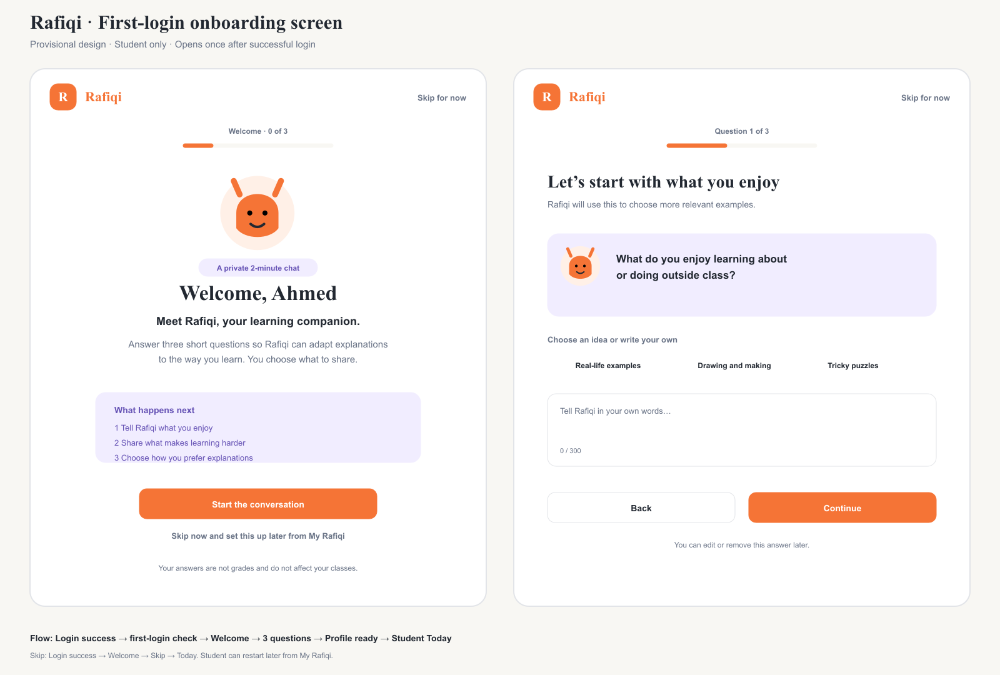
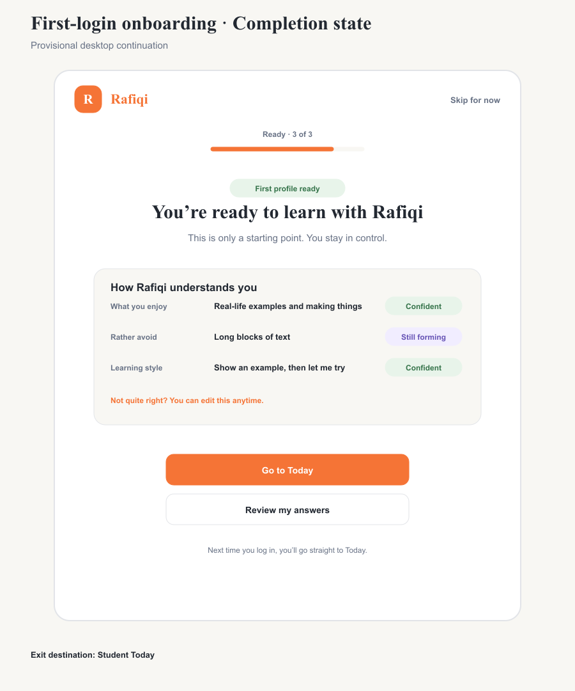

# Board 32 — First-login student onboarding





[Editable welcome/question SVG](32-first-login-onboarding.svg) · [Editable completion SVG](32-first-login-onboarding-complete.svg)

## Superseded by Board 34

The user selected the professional visual direction documented in [Board 34](34-first-login-onboarding-selected.md) on 2026-09-14. This board remains the interaction and routing specification.

## Status

**Provisional design for approval. Do not implement yet.**

This board replaces the proposed direction in Boards 30 and 31. It is a standalone student onboarding screen shown immediately after the student's first successful login, before the normal student shell or Today page appears.

## Trigger and routing concept

```text
Student login succeeds
        ↓
Has completed or skipped onboarding?
  No → First-login onboarding → Student Today
 Yes → Student Today
```

- Show once for a new student after successful authentication.
- Keep the onboarding outside the regular student navigation so the first task stays focused.
- **Skip for now** exits to Student Today and makes onboarding available later from **My Rafiqi**.
- Completing question three shows the profile-ready state, then **Go to Today**.
- Returning students never see this screen unless they intentionally restart it from My Rafiqi.
- The implementation mechanism for remembering completion depends on A1/A8 and is not authorized by this design.

## Screen sequence

1. **Welcome:** explain Rafiqi, the three questions, what the answers affect, and the voluntary nature of the flow.
2. **What you enjoy:** optional chips plus free text.
3. **What makes learning harder:** optional chips plus free text.
4. **How you prefer explanations:** optional chips plus free text.
5. **Profile ready:** show all three answers, certainty labels, correction access, and the Today destination.

## Welcome copy

- Title: **Welcome, Ahmed**
- Introduction: **Meet Rafiqi, your learning companion.**
- Body: **Answer three short questions so Rafiqi can adapt explanations to the way you learn. You choose what to share.**
- Primary action: **Start the conversation**
- Secondary action: **Skip for now**
- Exit explanation: **Skip now and set this up later from My Rafiqi.**
- Trust statement: **Your answers are not grades and do not affect your classes.**

## A2 question copy

1. **What do you enjoy learning about or doing outside class?**
2. **What kinds of explanations, activities, or schoolwork make learning harder for you?**
3. **How do you prefer learning: seeing an example, talking it through, trying it yourself, or something else?**

Each screen offers suggestions without preselecting one. The student may type up to 300 characters, go back, or skip the remaining questions.

## A3 profile-ready behavior

- Present the three learner-profile items together before exiting.
- Mark each item **Confident** or **Still forming** using text and color.
- **Confident** means the student gave a clear, direct preference.
- **Still forming** means the response was partial, ambiguous, or skipped.
- Provide **Review my answers** before **Go to Today**.
- Keep **Not quite me?**, edit, and discussion controls in My Rafiqi after onboarding.

## State matrix

| State | Required behavior |
| --- | --- |
| Eligibility loading | Hold the post-login transition; do not flash Today or onboarding |
| Welcome | Explain purpose, privacy boundary, Start, and Skip |
| Question | Show one question, progress, suggestions, free text, Back, Continue, Skip |
| Empty answer | Continue remains disabled; Skip remains available |
| Saving answer | Preserve input and show progress without changing focus |
| Answer error | Preserve input; offer Retry and Continue without saving |
| Profile ready | Show all profile items, certainty, review, and Today exit |
| Skipped | Brief acknowledgment, then Student Today |
| Already completed | Route directly to Student Today |

## Visual direction

- Focused centered card on the neutral Rafiqi background.
- Minimal top bar with logo, progress, and persistent Skip; no student sidebar or bottom navigation.
- Orange primary action, lavender Rafiqi prompt, sage confident status, and semantic text labels.
- Keep a compact Rafiqi character illustration as a supportive presence.
- Desktop content width stays readable at roughly 680–760 px. Mobile uses full-width stacked controls.

## Accessibility

- Maintain 44 px minimum targets and visible keyboard focus.
- Focus the page heading on entry, then the question heading after navigation.
- Announce progress as **Question 1 of 3** and expose the progress bar value.
- Do not auto-advance when a suggestion is selected.
- Do not use certainty color without its written label.
- Respect reduced-motion preferences for screen transitions.

## Approval decision

Approval of Board 32 authorizes this screen and navigation concept for implementation in the existing frontend. It does not authorize backend persistence, production AI inference, or data sharing. Those remain governed by A1 and A8.
