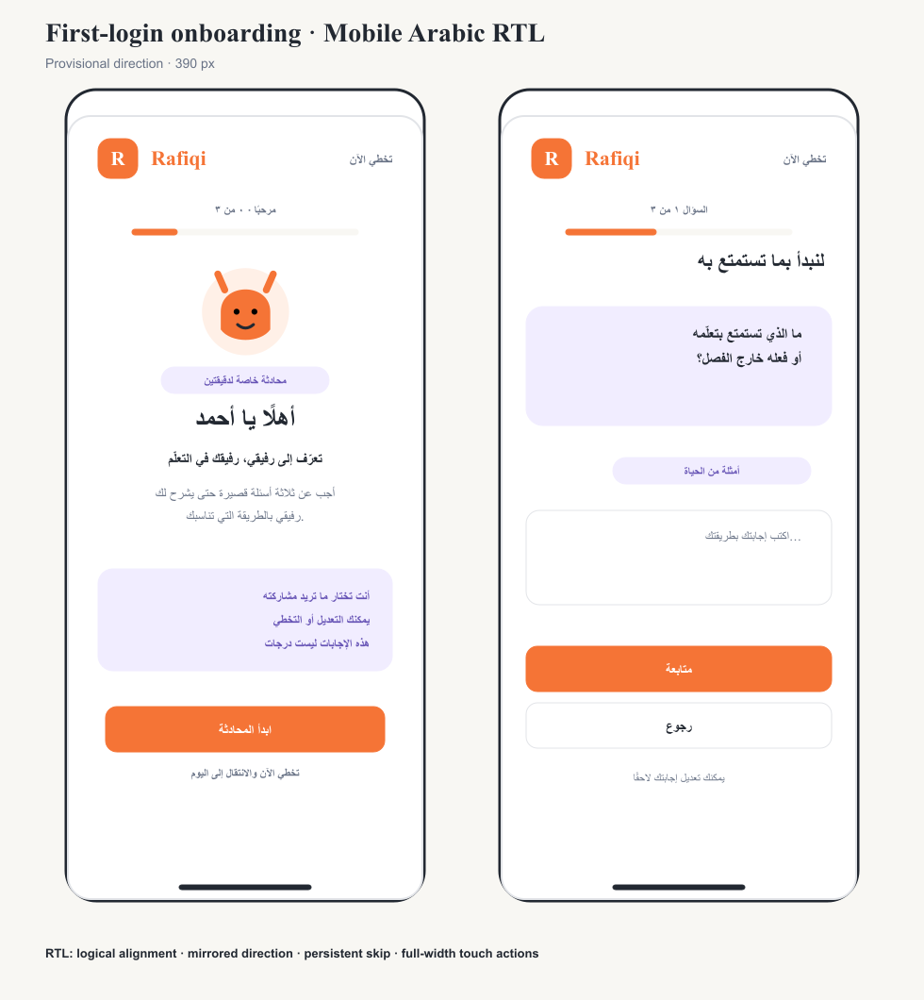

# Board 33 — First-login onboarding mobile Arabic RTL

[Open editable SVG](33-first-login-onboarding-mobile-arabic.svg)

## Superseded by Board 34

The user selected the professional visual direction documented in [Board 34](34-first-login-onboarding-selected.md) on 2026-09-14. This board remains the interaction and routing specification.

## Status

**Provisional companion design for Board 32. Do not implement yet.**

## Direction

- Stand a focused post-login screen without the regular student navigation.
- Keep **تخطي الآن** visible in the top action area.
- Mirror directional controls and align text to the logical start edge.
- Use full-width primary and secondary actions with at least 44 px height.
- Preserve the sequence: welcome, three questions, profile ready, then Student Today.

## Key Arabic copy

| Intent | Arabic |
| --- | --- |
| Welcome, Ahmed | أهلًا يا أحمد |
| Meet Rafiqi, your learning companion | تعرّف إلى رفيقي، رفيقك في التعلّم |
| Start the conversation | ابدأ المحادثة |
| Skip for now | تخطي الآن |
| Question 1 of 3 | السؤال ١ من ٣ |
| Continue | متابعة |
| Back | رجوع |
| Your first profile is ready | ملفك الأول جاهز |
| Go to Today | الانتقال إلى اليوم |

Arabic copy remains subject to final product-language review. The board establishes hierarchy, layout, and RTL behavior.

## Boundary

This board is design-only and does not change authentication, routing, storage, or application code.

