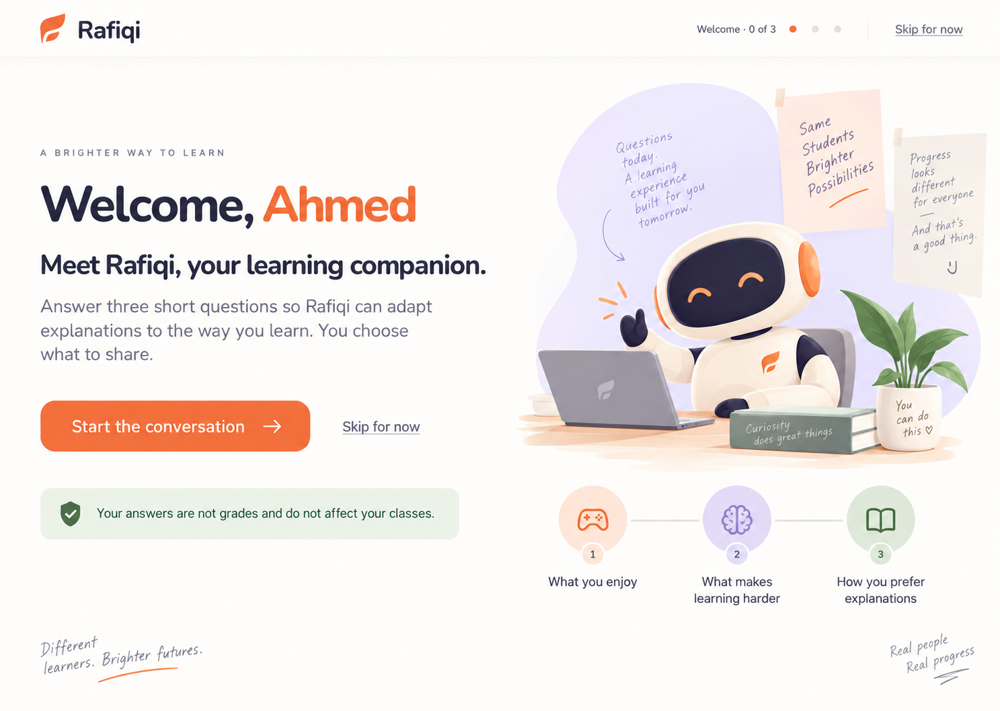

# Board 34 — Selected first-login onboarding direction

## Status

**Selected by the user on 2026-09-14 and approved for frontend implementation.** This direction supersedes the provisional Boards 32 and 33 as the visual target while preserving their first-login trigger, interaction specification, Arabic RTL requirement, and A1/A8 boundary.

## Selected direction

- Warm, full-canvas split layout with generous whitespace.
- Clear welcome hierarchy and one strong primary action.
- Persistent **Skip for now** in the minimal top bar.
- Rafiqi companion illustration as the visual anchor.
- Three-step preview for enjoyment, learning friction, and explanation preference.
- Sage trust statement clarifying that answers are not grades.
- No regular student navigation until onboarding completes or is skipped.

## Implementation mapping

- Route: `/[locale]/onboarding`, protected for authenticated students.
- Default student login destination: onboarding eligibility check.
- Returning or skipped students: redirect to `/[locale]/student/today`.
- Question screens retain the selected palette, typography, illustration, progress, and step preview.
- Completed answers update the existing session-only learner profile demonstration.
- English LTR and Arabic RTL use the same hierarchy and logical layout behavior.

## Boundary

The approved frontend slice may store only a per-student browser completion marker and the existing session-only demonstration answers. It does not authorize server persistence, production inference, teacher or guardian access, cross-device history, or data sharing. A1 and A8 remain prerequisites for those behaviors.
