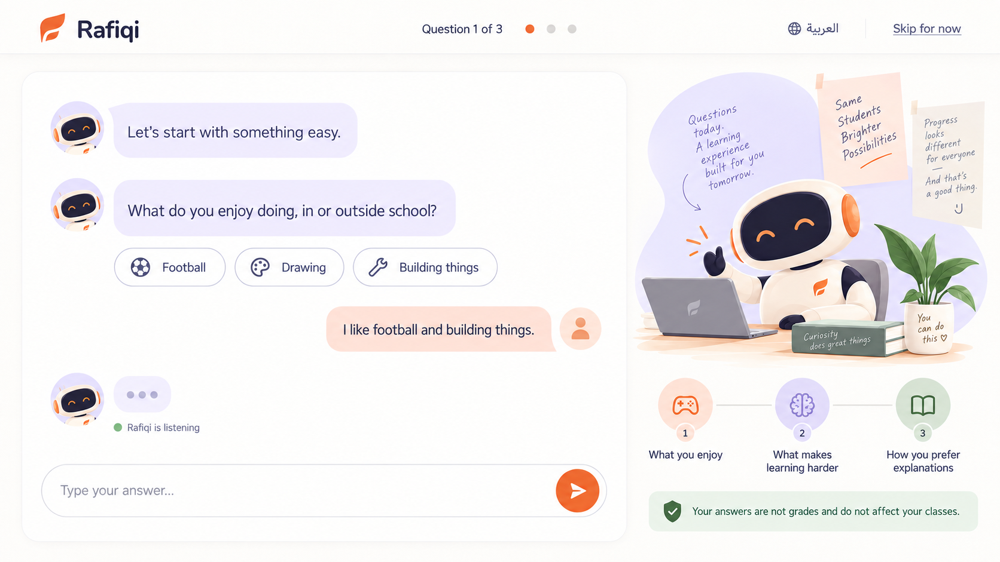

# Board 35 — First-login onboarding chat concept

## Status

**Approved by the user and implemented on 2026-09-16.** This is now the active visual direction for the three onboarding question steps. [Board 34](34-first-login-onboarding-selected.md) and `student-onboarding-form-reference.tsx` preserve the previous form-step direction for rollback/reference.

## Proposed direction

- Preserve Board 34's warm canvas, minimal header, persistent Skip action, Rafiqi companion illustration, three-question journey preview, trust statement, bilingual hierarchy, and browser-only data boundary.
- Present the three onboarding questions as one continuous conversation with Rafiqi.
- Use assistant and student message bubbles, optional suggestion chips, a listening/typing state, and a persistent message composer.
- Keep progress visible without making the experience feel like a conventional multi-step form.
- Retain review and completion behavior before entering Student Today.

## Boundary

This board replaces Board 34 only for the active question-step presentation. It does not authorize backend persistence, production inference, teacher or guardian access, cross-device history, or data sharing.
