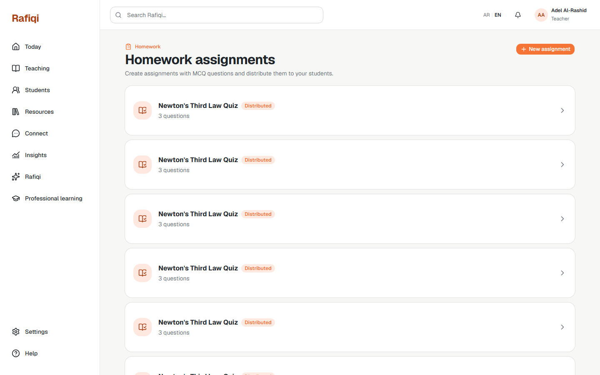

# Board 36 — E1 Teacher: Homework Assignment List

## Purpose

Desktop reference for **E1 Teacher Homework** — the list view where a teacher sees all their homework assignments and can create new ones.

## Approval

**Implemented and live (2026-09-22).** Corresponds to route `/teacher/homework`. This is the entry point to the Epic E homework authoring flow.

## Required UI

- Page heading "Homework assignments" with subtitle describing MCQ creation and distribution.
- **+ New assignment** button (primary, top-right) navigates to the creation form.
- Each assignment row shows: title, status badge (`Draft` / `Distributed` / `Closed`), question count.
- Clicking a row navigates to the edit/builder page for that assignment.
- Teacher-scoped: only assignments belonging to the authenticated teacher's school are listed.

## Boundary

List is read-only. All mutations (create, edit, distribute) happen on separate pages. No student data is shown here.
