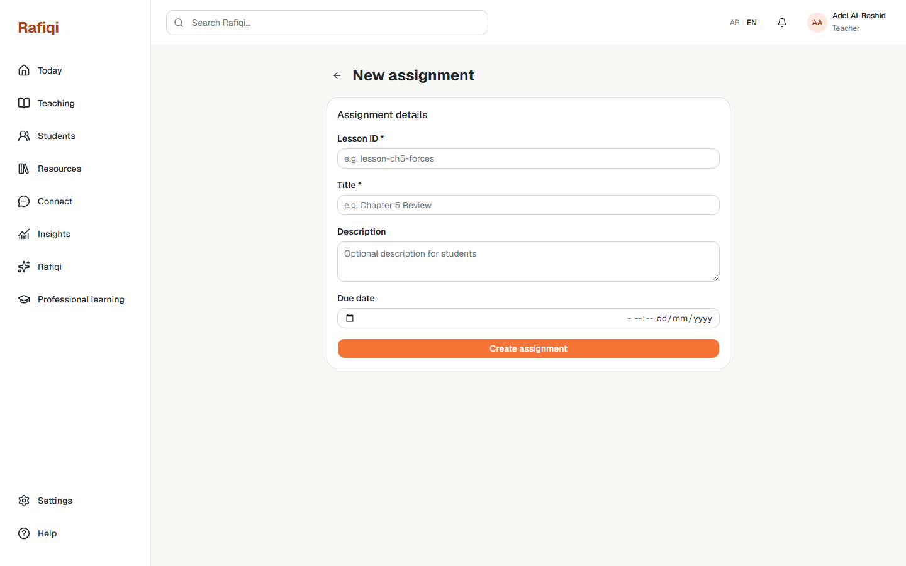
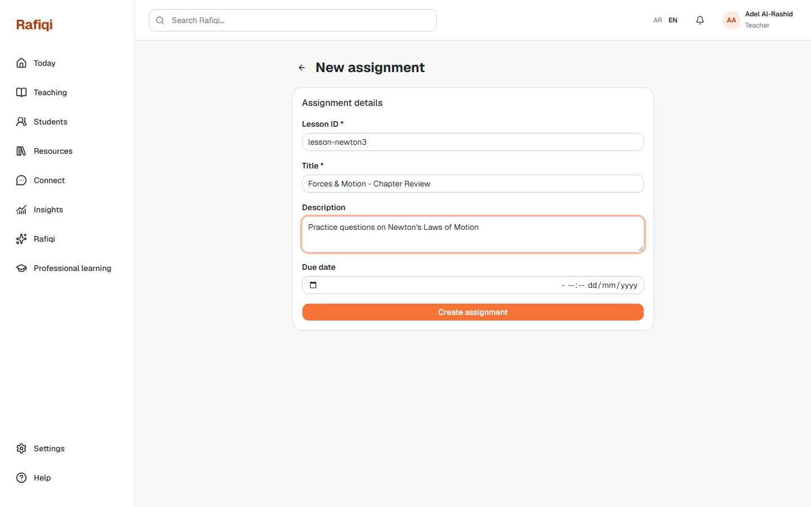

# Board 37 — E1 Teacher: New Homework Assignment Form

## Purpose

Desktop reference for **E1 Teacher Homework** — the creation form where a teacher defines a new MCQ assignment before adding questions.

## Approval

**Implemented and live (2026-09-22).** Corresponds to route `/teacher/homework/new`. On successful submit, redirects to the edit/builder page for the new assignment.

## Required UI

- `lesson_id` text input — ties the assignment to a lesson (currently a free-text ID; v2 will be a lesson picker).
- `title` text input (required).
- `description` textarea (optional).
- `due_at` date/time picker for the submission deadline.
- **Create assignment** submit button; disabled until title is filled.
- On success: assignment is created in `draft` status and user is redirected to `/teacher/homework/{id}/edit`.

## Boundary

This form creates the assignment shell only — no questions at this stage. Question authoring and distribution happen on the edit page.
