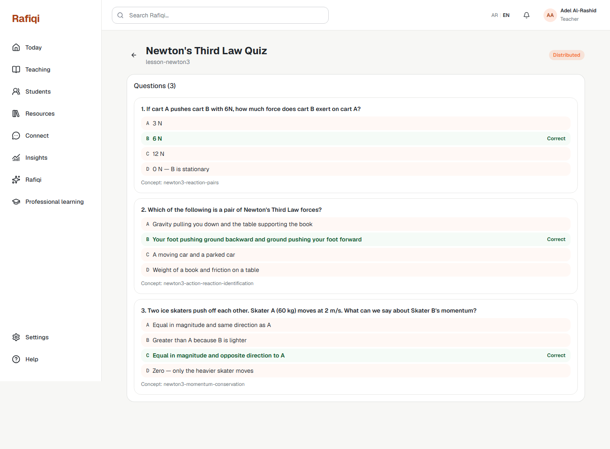
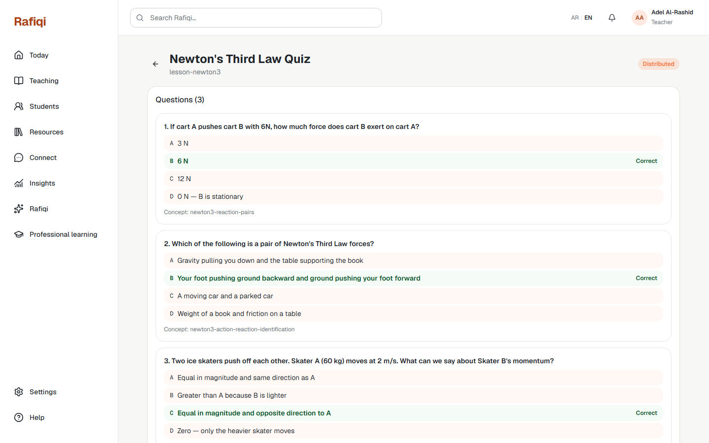

# Board 38 — E1 Teacher: Homework Edit / Question Builder

## Purpose

Desktop reference for **E1 Teacher Homework** — the full edit page where a teacher manages questions and distributes the assignment.

## Approval

**Implemented and live (2026-09-22).** Corresponds to route `/teacher/homework/{assignmentId}/edit`.

## Required UI

### Assignment header
- Title, description, lesson ID, due date displayed at top.
- **Edit** button to update metadata (inline or modal).
- **Distribute** button — opens the distribute dialog (see below); enabled once at least one question exists.

### Question list
- Each question card shows: question text, all four options (A–D), correct answer highlighted in green with "Correct" label.
- **Delete** button per question.
- Question index numbers (1, 2, 3…).

### Add question form (below question list)
Fields:
- `question_text` — the question stem.
- Option A, B, C, D — one text input each.
- `correct_answer` — radio or select (A/B/C/D).
- `concept_ref` — the mastery concept this question maps to (for gap-digest aggregation).
- **Add question** submit button.

### Distribute dialog
- Lists students in the teacher's school who have not yet received this assignment.
- Multi-select checklist.
- **Distribute** confirm button; sets assignment status to `distributed` and creates `StudentAssignment` records.
- Once distributed, the assignment cannot return to draft.

## Security

`correct_answer` and `internal_answer_key` are shown here (teacher view only). These fields are never returned to student API endpoints.
