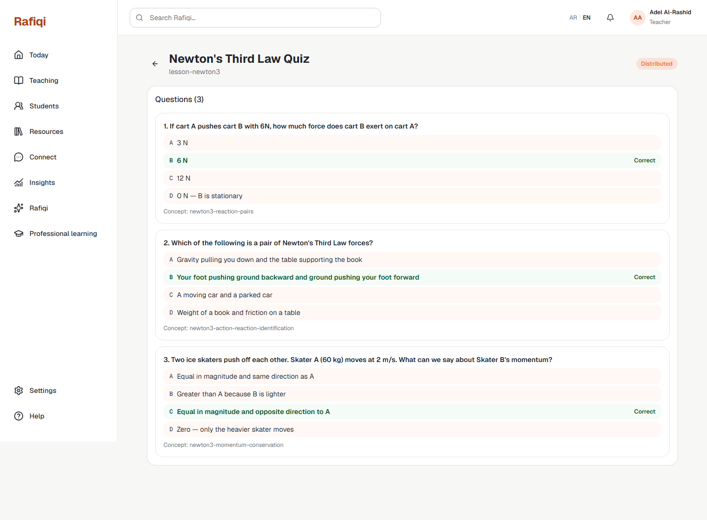
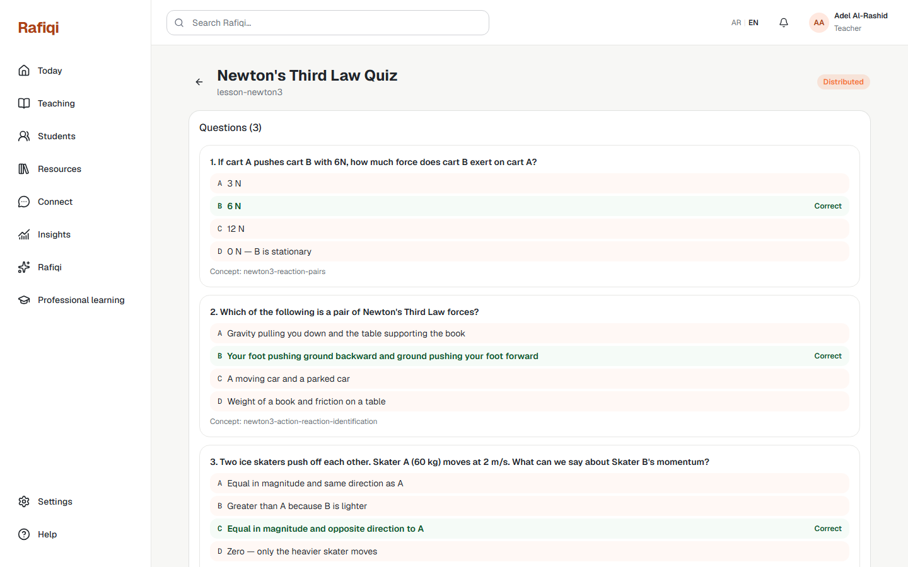

# Board 38 — E1 Teacher: Homework Edit / Question Builder

## Purpose

Desktop reference for **E1 Teacher Homework** — the full edit page where a teacher manages questions and distributes the assignment.

## Approval

**Implemented and live (2026-09-22).** Corresponds to route `/teacher/homework/{assignmentId}/edit`.

**2026-09-29 approved extension:** Homework is a teacher-authored assessment,
not a chat surface. Each question carries up to three teacher-written static
hints. This extends the fields below.

**2026-09-29 approved correction:** three hints is the **maximum**, not a
requirement. A teacher may author fewer; a student can never reveal more than
three. The earlier "exactly three" wording is superseded.

## Required UI

2026-09-27 approved clarification: the earlier fixed four-option wording below
is deprecated in favor of the [manual MCQ maintenance scope](../../docs/RAFIQI_PRODUCT_AND_DESIGN_REFERENCE.md#approved-homework-maintenance-scope--2026-09-27).
Keep four options by default and allow two to six unique options.

### Assignment header
- Title, description, lesson ID, due date displayed at top.
- **Edit** button to update metadata (inline or modal).
- **Distribute** button — opens the distribute dialog (see below); enabled once at least one question exists.

### Question list
- Each question card shows: question text, all four options (A–D), correct answer highlighted in green with "Correct" label.
- **Delete** button per question.
- Question index numbers (1, 2, 3…).

### Add question form (below question list)
Fields:
- `question_text` — the question stem.
- Option A, B, C, D — one text input each.
- `correct_answer` — radio or select (A/B/C/D).
- `concept_ref` — the mastery concept this question maps to (for gap-digest aggregation).
- `hints` — up to three static hints, entered and ordered by the teacher from
  least to most revealing. Fewer than three is valid; more is rejected.
- **Add question** submit button.

### Distribute dialog
- Lists students in the teacher's school who have not yet received this assignment.
- Multi-select checklist.
- **Distribute** confirm button; sets assignment status to `distributed` and creates `StudentAssignment` records.
- Once distributed, the assignment cannot return to draft.

## Security

`correct_answer` and `internal_answer_key` are shown here (teacher view only). These fields are never returned to student API endpoints.
