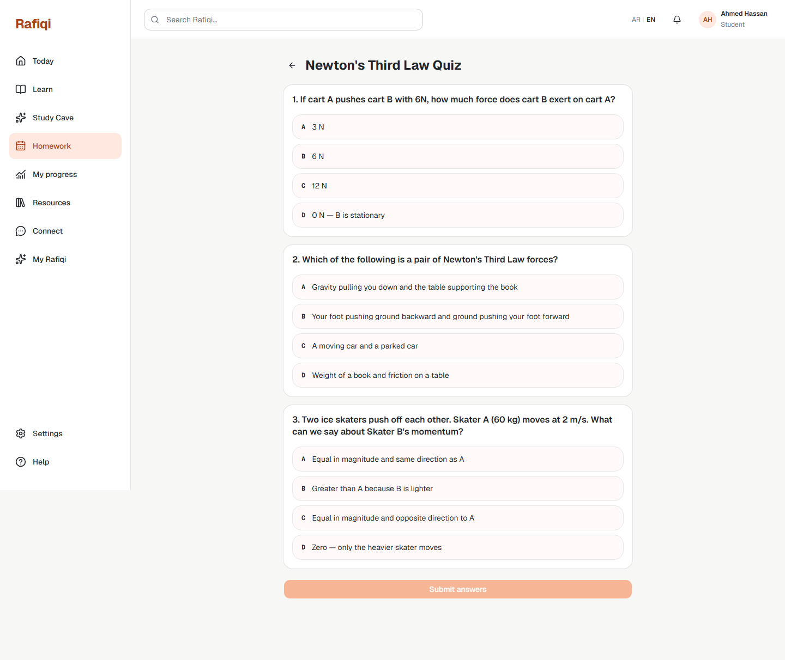
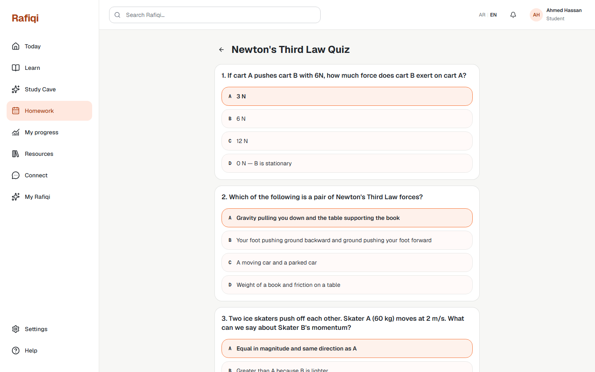

# Board 39 — E1 Student: MCQ Homework Quiz

## Purpose

Desktop reference for **E1 Student Homework** — the quiz-taking view where a student answers MCQ questions for a distributed assignment.

## Approval

**Implemented and live (2026-09-22).** Corresponds to route `/student/homework/{studentAssignmentId}`.

## Required UI

### Header
- Back arrow → `/student/homework` list.
- Assignment title and optional description.

### Question cards
- One card per question, numbered (1, 2, 3…).
- Question stem in card header.
- Options A–D as full-width buttons, each showing the letter prefix and option text.
- Clicking an option highlights it with a primary-color border and fill; previous selection for that question is cleared.

### Answer states (before submission)
- Unselected: neutral border, light secondary fill.
- Selected: primary (orange) border and tint, bold text.

### Submit button
- Full-width, at the bottom of the question list.
- **Disabled** until every question has a selection (`allAnswered`).
- Shows a loading spinner while the request is in flight.

## Security

The API endpoint `GET /homework/me/assignments/{id}` never returns `correct_answer` for any question — only question text and option text. The correct answer is only revealed after the student submits.
