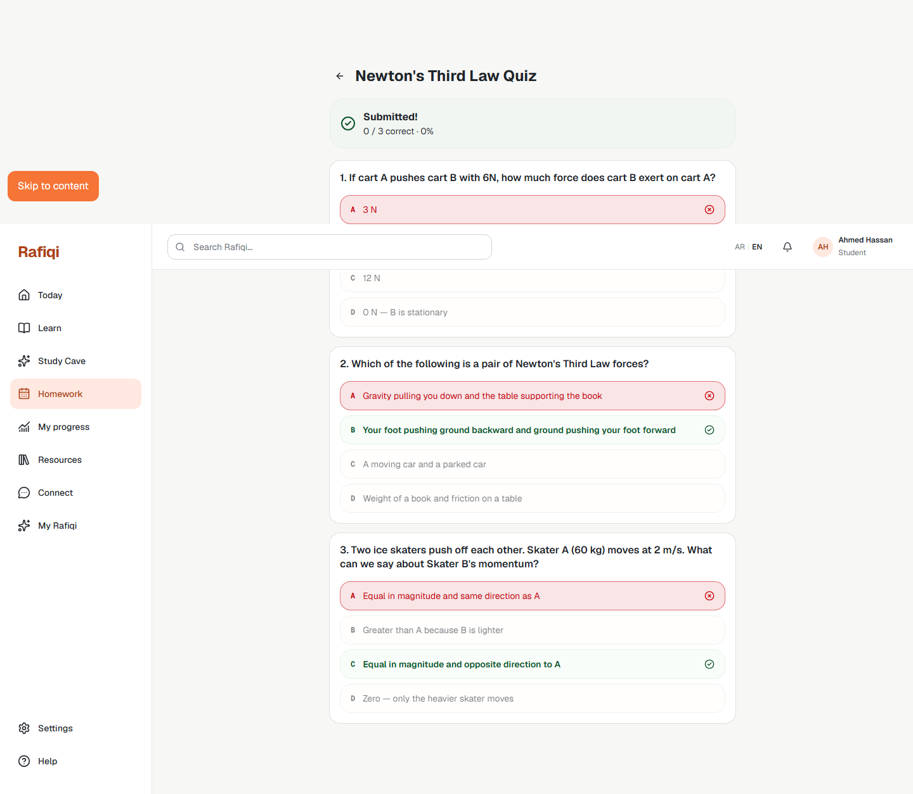

# Board 40 — E1 Student: Homework Results

## Purpose

Desktop reference for **E1 Student Homework** — the results view shown immediately after a student submits their MCQ answers.

## Approval

**Implemented and live (2026-09-22).** Same route as the MCQ view (`/student/homework/{studentAssignmentId}`); the component transitions to results state in-place after a successful submit.

## Required UI

### Score banner
- Green success container at top of page.
- Check-circle icon.
- "Submitted!" heading.
- Score line: `{correct} / {total} correct · {percent}%`.

### Question cards (post-submission state)
Each option within a card renders in one of three styles:

| Condition | Style |
|---|---|
| Correct answer (whether or not selected) | Green border + tint, bold text, green check-circle icon |
| Student's wrong selection | Red/destructive border + tint, red X-circle icon |
| Other unselected wrong options | Neutral border, reduced opacity (60%) |

- All option buttons are disabled (no further interaction).
- Submit button is hidden once results are shown.

### Mastery side-effect
On submission the backend writes a `MasteryRecord` per question concept, which feeds into the student's learning profile and the teacher's gap-digest view.

## Security

`correct_answer` is returned in the submit response only, never in the pre-submission GET. The client receives it as part of `SubmissionResult.results[]` and only displays it after a successful `POST /homework/me/assignments/{id}/submit`.
